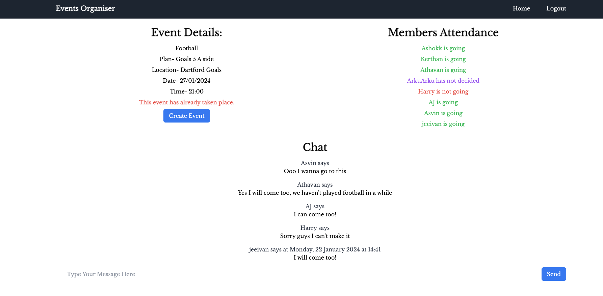
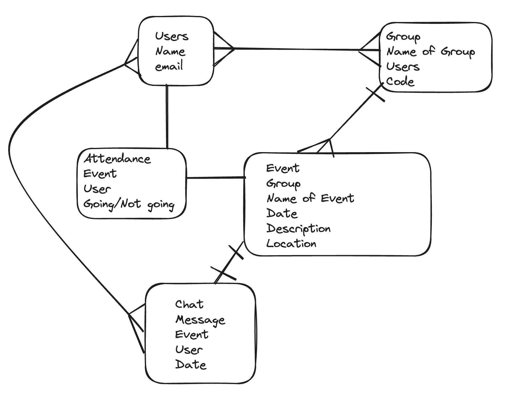

# Events Organiser ReadMe



## Project Description

Allows users to create their own groups with unique codes and within groups allows users to create events and users can select if they are going or not going. Have a discussion section for each specific event. Have an events page for each group to show all events- past, upcoming.

## Table of Contents

- [Deployment Link](#deployment-link)
- [Technologies Used](#technologies-used)
- [Planning](#planning)
- [Build Process](#build-process)
- [Challenges](#challenges)
- [Wins](#wins)
- [Key Learnings/Takeaways](#key-learningstakeaways)
- [Future Improvements](#future-improvements)

## Deployment Link

https://events-organiser-frontend-production.up.railway.app/

## Technologies Used

React Express Node.js MongoDB Tailwind CSS HTML Vanilla Javascript ES6

## Planning

**Sign up/Login Pages**

Using email and password for login

If user does not have a login, there will be a reigister hyperlink to take user to the sign up page

**Create Group**

Ask user to input Name of group

Then user can create group which will automatically generate a 4 digit unique code

Once created it will redirect the user to the home page of that group

**Join Group**

Enter unique code of already existing group

Entering this will add this user to the groups users attribute

**Group Home Page**

Show all events - Each of these are clickable

Show all users in the group

Display unique code for the group

Create Event button

**Individual Event Page**

This will display a description of event

Who’s going and not going

Show discussion chat at the bottom of the page

**Create Event Page**

Input title for event
Input description for event



## Build Process

**Setting up my backend**

One of my first objectives was setting up the schemas for all the entities I would be using in my application

```
const userSchema = new mongoose.Schema({
    name: {
      type: String,
      required: true,
    },
    email: {
      type: String,
      required: true,
    },
    password: {
      type: String,
      required: true
    },
    groupIds: [{
        type: mongoose.Schema.Types.ObjectId,
        ref: 'Group',
    }],
});

export const User = mongoose.model('User', userSchema)

```

**Creating Groups**

It would not have been possible to create events for the group without first creating the groups. Therefore, I prioritized the creation of groups, as I knew I would be able to test this feature before setting up authentication. I wanted to defer the authentication setup to a later stage, as I anticipated it would require more time to complete.

```
export async function createGroup (req, res) {
    try {
        let generatedCode;
        let existingGroup = true;

        while (existingGroup) {
            // Generate a 4-digit code
            generatedCode = Math.floor(1000 + Math.random() * 9000);

            // Check if a group with the generated code already exists
            existingGroup = await Group.findOne({ code: generatedCode });
        }

        // Create a new Group instance with the unique generated code
        const group = new Group({
            name: req.body.name,
            code: generatedCode,
        });

        // Save the new group to the database
        await group.save();

        // Return the created group in the response
        res.json(group);
    } catch (err) {
        res.status(500).send(err.message);
    }
}

export async function joinGroup(req, res) {
    try {
        const { email } = req.params;
        const { groupCode } = req.body;

        // Check if the user exists based on the provided email
        const user = await User.findOne({ email: email });

        if (!user) {
            return res.status(404).json({ message: "User not found" });
        }

        // Check if the group exists
        const group = await Group.findOne({ code: groupCode });
        if (!group) {
            return res.status(404).json({ message: "Group not found" });
        }

        // Update the user with the groupId
        await User.findByIdAndUpdate(user._id, {
            $addToSet: { groupIds: group._id },
        });

        res.json({ message: "User joined the group successfully" });
    } catch (err) {
        res.status(500).send(err.message);
    }
}
```

**Creating events**

This part was fairly straightforward for me, as I could leverage my previous experience with using forms to send data to the database. I applied a similar method when creating events for each group.

```
export async function createEvent (req, res) {
    try {

        const { groupId } = req.params;

        // Create Event
        const event = new Event({
            name: req.body.name,
            description: req.body.description,
            location: req.body.location,
            date: req.body.date,
            time: req.body.time,
            groupId: groupId, // referencing the group ID
        })
        await event.save()
        res.json(event)
    } catch (err) {
        res.status(500).send(err.message);
    }
}
```

## Challenges

Had a challenge during the coding of my authentication as I would need to make sure the passwords of the users were decrypted in the databases but I needed to make sure to account for the decrypting the password when checking the password to log a user in .

```
export async function login(req, res) {
    try {
        const {email, password} = req.body

        // Check if the user exists based on the provided email
        const existingUser = await User.findOne({ email: email });

        if (existingUser) {
            // Comparing provided password with the hashed password
            const isPasswordValid = await bcrypt.compare(password, existingUser.password);
            // Check if the provided password matches the stored password
            if (isPasswordValid) {
                res.json("Success");
            } else {
                res.status(401).json("Incorrect password");
            }
        } else {
            // If the user does not exist, return a 404 status
            res.status(404).json("User not found");
        }
    } catch (error) {
        console.error(error);
        res.sendStatus(500).json("Internal Server Error");
    }
}
```


## Wins

Being able to setup the authentication myself despite the amount of difficulty I have had with authentication in previous projects

```
export async function register(req, res) {
    try {
        const {name, email, password} = req.body

        const encryptedPassword = await bcrypt.hash(password, 10)

        const existingUser = await User.findOne({ email:email })

        if (existingUser) {
            return res.status(409).json("Email already exists");
        }

        const newUser = new User({
            name: name,
            email: email,
            password: encryptedPassword
        });
        await newUser.save()
        res.sendStatus(200)
        console.log("User saved");
    }   catch {
        res.sendStatus(500)
        console.log("User not saved");
    }
}

```

Being able to make a group chat that dynamically renders so a user is able to stay up to date with their chat without having the reload the screen every new message

```
      useEffect(() => {
        const interval = setInterval(() => {
          fetchMessages();
        }, 2000);
    
        return () => clearInterval(interval);
        // eslint-disable-next-line
      }, [groupId]);
```

## Key Learnings/Takeaways

I have found what worked for me was getting the backend server side of the project functioning initially and checking the endpoints were working with postman helped me to have an easier time when working on the front end after

```
export async function createEvent (req, res) {
    try {

        const { groupId } = req.params;

        // Create Event
        const event = new Event({
            name: req.body.name,
            description: req.body.description,
            location: req.body.location,
            date: req.body.date,
            time: req.body.time,
            groupId: groupId, // referencing the group ID
        })
        await event.save()
        res.json(event)
    } catch (err) {
        res.status(500).send(err.message);
    }
}

export async function displayAllEvents(req, res) {
    try {
        const events = await Event.find();
        res.status(200).json(events);
    } catch (error) {
        console.error(error);
        res.status(500).json({ message: "Internal Server Error" });
    }
}
```

## Future Improvements

- To get experience using useContext in React so that I do not have to rely on the local storage to pass information between different pages

- To convert the React.js into TypeScript files instead to get more experience with using this and using a different approach then coding the whole project with TypeScript from the beginnning